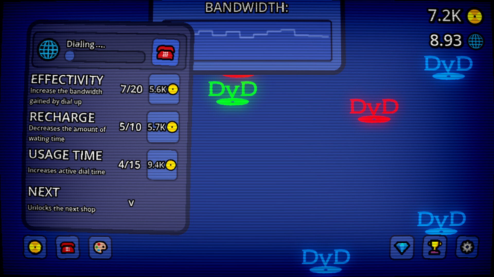

# Projects October 2025

## Text adventure Game/Editor [link](https://github.com/Cybo3D/TAG)
this is an "engine" i made where you can make / play text based adventure games, it parses / serializes json. [unfinished]

## Vestabord [link](https://github.com/Cybo3D/VESTABORD)
For school i needed to make a c# application that uses a vestabord that we have, it pushes a double string to the bord via an ethernet cable

## The DvD idle game [link](https://store.steampowered.com/app/3801340/The_DvD_idle_game/)
This is a game i have been making for a couple of months in my spare time at home, its gonna be released at the end of november

## [And more on my github page](https://github.com/Cybo3D)